<picture>
  <source media="(prefers-color-scheme: dark)" srcset="./assets/banner.svg">
  <source media="(prefers-color-scheme: light)" srcset="./assets/banner-light.svg">
  
</picture>

 

<!-- 

# Hey, I'm Sachin Kushwaha 👋

### Full Stack Developer crafting clean, scalable, and thoughtful software

 -->

<table width="100%">
  <tr>
    <td width="32%" valign="top" align="center">
      
    </td>
    <td width="68%" valign="top" align="center">
      
    </td>
  </tr>
</table>

 

---

<h2 align="center">About Me</h2>

I'm a Full Stack Developer based in Gorakhpur, Uttar Pradesh, India, focused on building 
reliable web and mobile applications from the ground up. I enjoy working across the stack — 
designing clean UIs, building robust backends, and shipping products that people actually use. 
Currently exploring the intersection of applied AI and modern app development.

 

---

<h2 align="center">Tech Stack</h2>

<table align="center">
  <tr>
    <td align="center" valign="top" width="20%">
      <b>Frontend</b>  
       
       
       
       
      
    </td>
    <td align="center" valign="top" width="20%">
      <b>Backend</b>  
       
       
       
      
    </td>
    <td align="center" valign="top" width="20%">
      <b>Database</b>  
       
       
      
    </td>
    <td align="center" valign="top" width="20%">
      <b>DevOps</b>  
       
       
       
      
    </td>
    <td align="center" valign="top" width="20%">
      <b>AI &amp; Learning</b>  
       
       
      
    </td>
  </tr>
</table>

 

---

<h2 align="center">Developer Dashboard</h2>

  

 

  
  

 

---

<h2 align="center">Featured Projects</h2>

<table align="center" width="100%">
  <tr>
    <td width="33%" valign="top">
      <h3 align="center">Buy247</h3>
      

        A full-featured e-commerce platform with real-time inventory, 
        secure checkout, and a scalable order management system.
      

      

        
        
        
      

      

        
        
      

    </td>
    <td width="33%" valign="top">
      <h3 align="center">BlogBook</h3>
      

        A modern blogging platform with rich-text editing, 
        tag-based discovery, and a distraction-free reading experience.
      

      

        
        
        
      

      

        
        
      

    </td>
    <td width="33%" valign="top">
      <h3 align="center">AI Chatbot</h3>
      

        A conversational AI assistant powered by LLMs, built with 
        context-aware memory and a lightweight embeddable widget.
      

      

        
        
        
      

      

        
        
      

    </td>
  </tr>
</table>

 

---

<h2 align="center">Current Focus</h2>

| Area | Focus |
|:--|:--|
| Mobile Development | Building cross-platform applications with React Native |
| Artificial Intelligence | Learning Generative AI and LLM-based application design |
| Backend Engineering | Deepening expertise in FastAPI and API architecture |
| Community | Contributing to open source projects |

 

---

<h2 align="center">Connect With Me</h2>

 

---

<h2 align="center">Contribution Snake</h2>

  <picture>
    <source media="(prefers-color-scheme: dark)" srcset="./assets/github-contribution-grid-snake-dark.svg">
    <source media="(prefers-color-scheme: light)" srcset="./assets/github-contribution-grid-snake.svg">
    
  </picture>

 

---

Designed and built by Sachin Kushwaha · Last updated 2026

  

